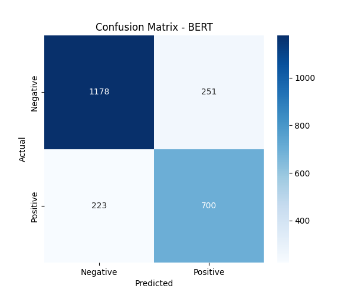
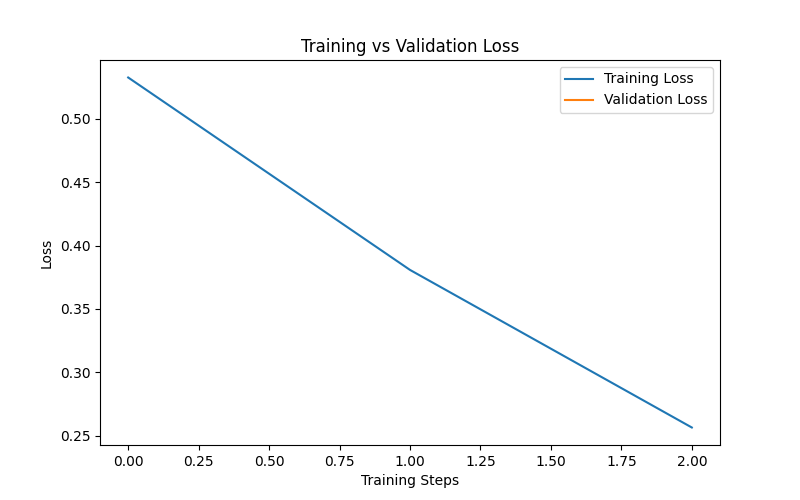
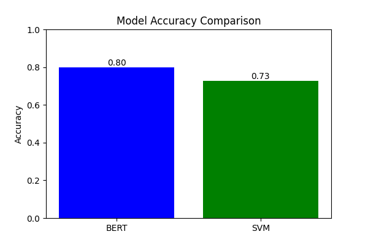

# Arabic Sentiment Analysis using AraBERT 🇸🇦

## 📌 Project Overview

This project implements **Arabic Sentiment Analysis** using the powerful **AraBERT transformer model**.

The system classifies Arabic text into:

* ✅ Positive
* ❌ Negative

---

## 🧠 Models Used

* **AraBERT (Transformer-based model)**
* **SVM (Baseline Machine Learning model)**

---

## 📊 Dataset

We used the **LABR Arabic Book Reviews Dataset**, which contains thousands of Arabic reviews.

---

## ⚙️ Features

* Arabic text preprocessing
* Fine-tuning AraBERT
* Sentiment classification
* Confusion Matrix visualization
* Training vs Validation loss graph
* Comparison between BERT and SVM

---

## 📈 Results

| Model   | Accuracy |
| ------- | -------- |
| SVM     | ~0.75    |
| AraBERT | ~0.78    |

---

## 📊 Visual Results

### Confusion Matrix



### Training Graph



### Model Comparison



---

## 📥 Download Trained Model

Due to GitHub size limitations, the trained model is not included in this repository.

You can download it from Google Drive:

👉 https://drive.google.com/drive/folders/1ncCieBwHDrW_6ogaHHq7uo8odQVPoZCS?usp=drive_link

After downloading, place the model inside:

```
models/sentiment_model
```

---

## 🚀 How to Run the Project

### 1️⃣ Install requirements

```bash
pip install -r requirements.txt
```

---

### 2️⃣ Run the notebook

Open the project in **Google Colab** or locally and run the training notebook.

---

### 3️⃣ Predict example

```python
predict("المطعم رائع والطعام لذيذ")
```

---

## 📂 Project Structure

```
arabic_sentiment_bert
│
├── data
├── models
│   └── (downloaded model here)
├── results
├── src
├── notebooks
├── requirements.txt
└── README.md
```

---

## ⚠️ Notes

* The trained model is excluded due to large size.
* Make sure to download the model before running prediction.

---

## 👩‍💻 Author

**Doaa Ali**

---

## ⭐ Acknowledgment

This project uses:

* HuggingFace Transformers
* AraBERT Model
* Scikit-learn
